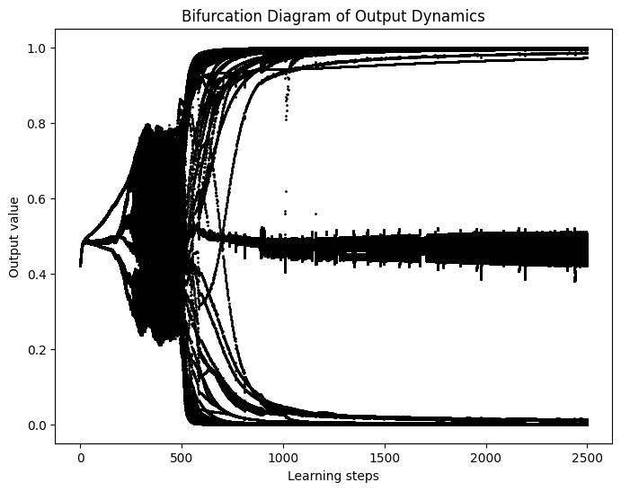
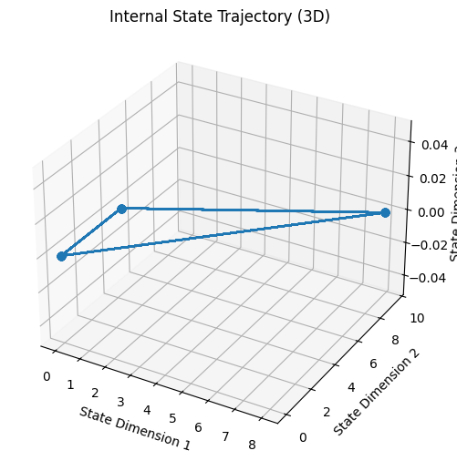
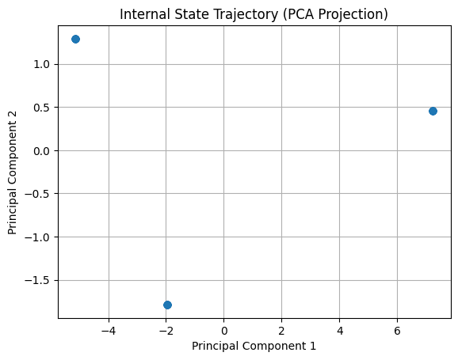
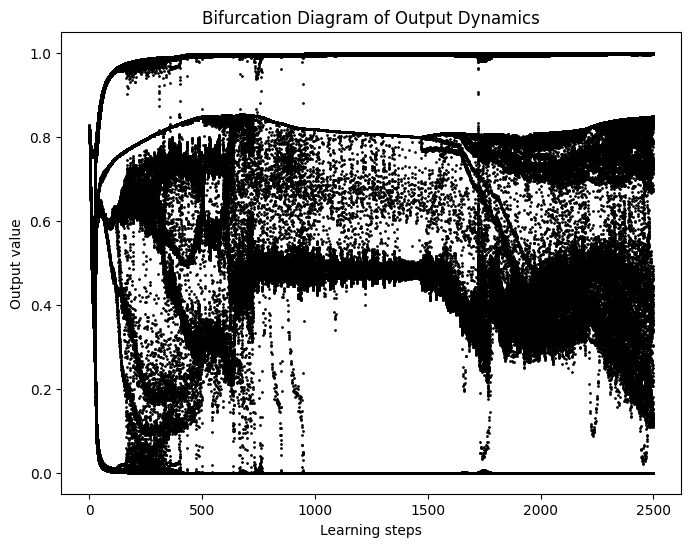
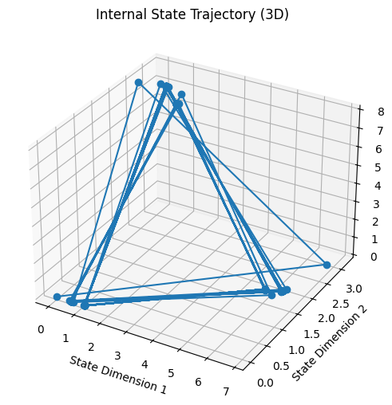
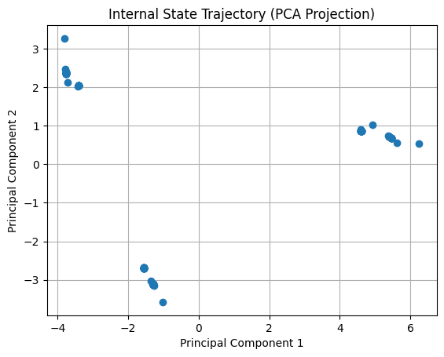

# Embedding a Grammatical Description in Deterministic Chaos
## Abstract
This repository code is inspired by the paper, [Embedding a Grammatical Description in Deterministic Chaos](https://groups.oist.jp/sites/default/files/imce/u102667/pdf_files/SCSL-TR-94-025.pdf).

The paper shows that:
> RNN learns to reconstruct the target process, represented by a stochastic finite state machine in the simulation. The result revealed the capability of the RNN to evolve, by means of learning, toward chaos which is able to mimic a target's stochastic process.

And this result indicates that:
> あたかも論理演算子や命題シンボルの組み合わせで体現されているように考えられる「思考活動」は、実際の内部操作において離散的シンボル計算など使わない、連続状態空間に定義されるダイナミックな心のモデルで構成できる    

referenced by「ロボットに心は生まれるか」

## Result
In this simulation, a simple RNN is used to learn a pattern of numbers generated in the sequence `0 -> 0 -> (1 || 0)`.  
 For example, the RNN model's objective is to predict the next value (0 or 1) when given a sequence like `100100100000100...`.

Here, we present the results for two cases: one where the RNN fails to learn properly and does not produce deterministic chaos, and another where learning is successful, leading to deterministic chaos.

### without deterministic chaos
This result shows that the model learns the limit cycling having a period of three, and the trajectory would simply is triangle connecting three points.

| output dynamics | 3D trajectory of states | 2D trajectory of states by PCA |
| --- | --- | --- |
|  |  |  |

### with deterministic chaos
This result shows that model does not learn limit cycling since each region has a certain width. 

| output dynamics | 3D trajectory of states | 2D trajectory of states by PCA |
| --- | --- | --- |
|  |  |  |

